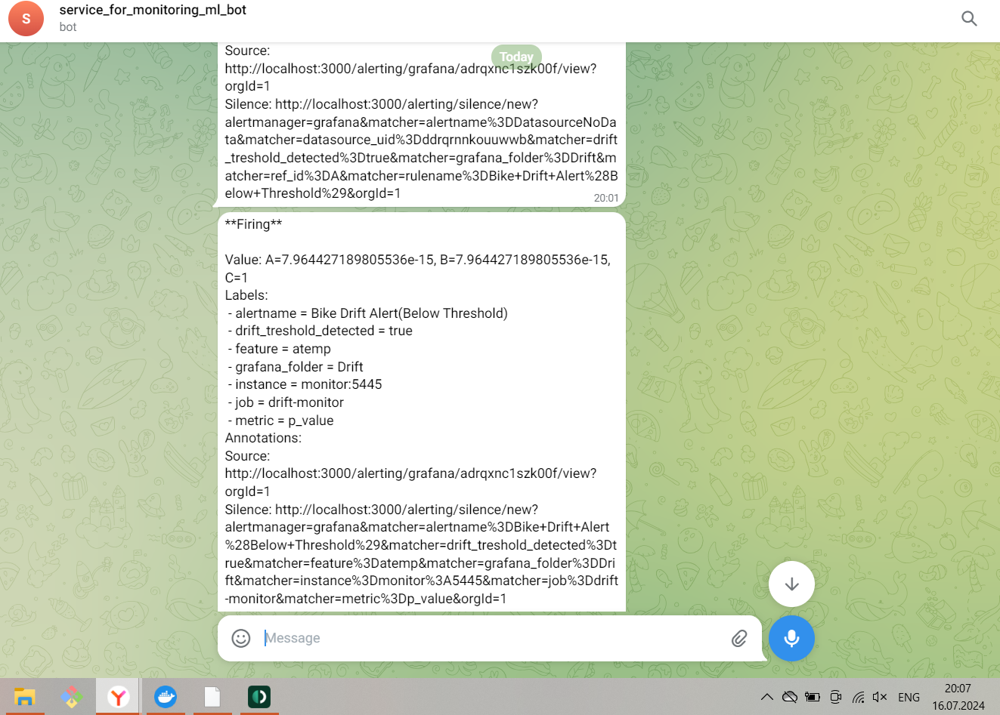

# ML monitoring platform service with Airflow, Grafana, Prometheus

**Airflow** - task scheduler;
**Grafana** - dashboards and alerters;
**Prometheus** - data storage;
**Stateful Monitor** - screen that displays statistics for monitoring. 

Architecture:


## Deployment 

**Step 1: Initial Settings**.
1. Execute ```docker-compose up`` and make sure that the service started correctly.
2. Go to the Airflow scheduler UI (http://0.0.0.0:8080/) and enter airflow as user and password.
3. Add dataset in path /airflow/data/audit(There are only example of data storage in real prject you can use s3 and other storages(SQL, GSC, etc)).
4. Let's check that the metrics are saved in the __Stateful Monitor__ service. To do this, call ```curl http://0.0.0.0:5445/metrics``` in the terminal.
5. Log in Grafana (http://0.0.0.0:3000/) with admin login and password.

**Step 2: Set up Grafana and Prometheus connection**
1. Click “Connections” -> “Add new connection” in the tab on the left.
2. Type Prometheus, click on Prometheus.
3. Click in the upper right corner “Add new data source”
4. In the settings enter the URL http://prometheus:9090
5. Click “Save & test” at the end.


**Step 3: Add a dashboard**
1. Go to the Dashboards tab in the tabik on the left.
2. Click “Create Dashboard” -> “Add visualization” -> “Prometheus”.
3. Set the configuration as on the screenshot.

4. Enter the name of the chart and click “Apply” as shown on the screen.

5. Click on the floppy disk sign (screenshot), enter the name of the dashboard “Data Drift”.

6. Check that the new “Data Drift” dashboard is available in the Dashboards tab.


**Step 4: Customize Alerting**.
1. Let's add a new alerting point in the form of a telegram bot. To do this, select “Alerting” -> “Concat points” in the tab on the left.
2. Set the configuration as in the example on the screenshot. Set your Chat ID, the one in the example is not existing. Click on the Test button and check that the message came to the chat with the corresponding Chat ID.


**Step 5: Add a rule to send the alert**
1. Go to “Alerting” -> “Alert rules” tab in the left tab.
2. Click on the “New alert rule” button.
3. Choose a name for the rule, and choose which metric the alerting will look at. The example in the screenshot below.

4. Specify that we should look at the last (Last) record of the metric, and alerter if its value is less than 0.05. The example on the screenshot.

4. In the “Set evaluation behavior” item set “Pending period” to 10s. This means that the rule will be checked every 10 seconds. Set the rest of the values according to the screenshot below.

5. Please set the drift_threshold_detected label to true if the rule is triggered.

6. Change the alert template in the “Add annotations” section if desired.
7. Next, click “Save rule and exit”.


**Step 6: Customize Notification Policies**
1. Go to the “Alerting” -> “Notification policies” tab in the left tab.
2. Click “New nested policy” and fill in the data in the box similar to the screenshot.

3. click “Save policy”


**Step 7: Check alerts**.
1. Rename the dataset “bike_sharing_dataset_4.csv.off” -> “bike_sharing_dataset_4.csv”.
2. Run the DAG “simple_detector”.
3. Check on the dashboard that the metrics have changed

4. Check that alerts are lit in Grafana, and wait for them in Telegram


Alert in Telegram channel:
